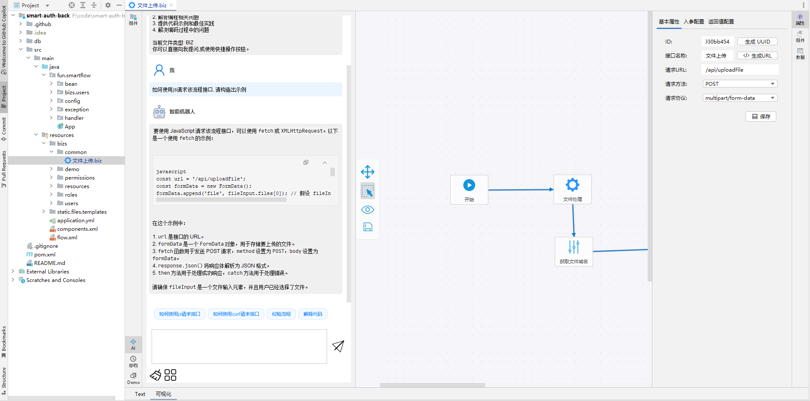
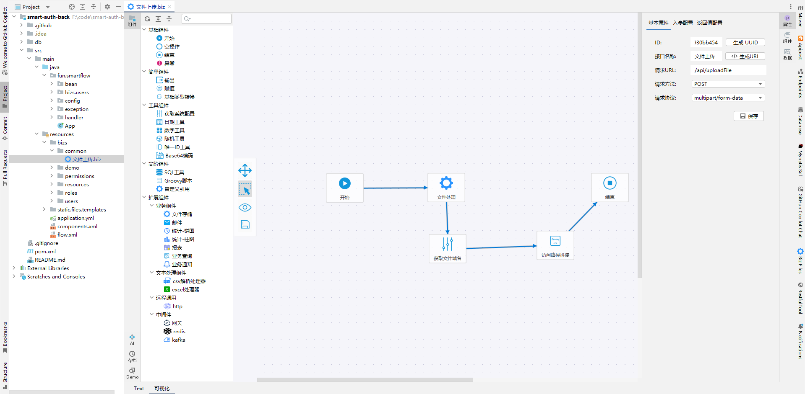
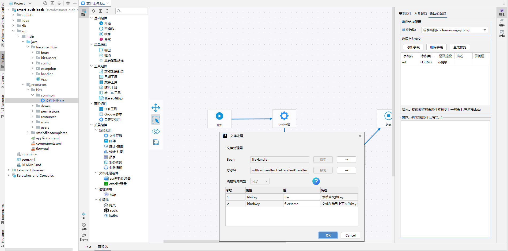

# smartf-flow-plugin

基于IntelliJ IDEA平台开发的可视化流程编排插件，适用于Java SpringBoot项目开发。

## 功能特点

- 可视化流程设计
- 支持SpringBoot项目集成
- 图形化流程编排界面
- 支持自定义节点和连线

## 环境要求

- IntelliJ IDEA 2023.1.7+
- JDK 1.8+
- SpringBoot 2.x+

## 安装使用

1. 在IDEA插件市场搜索"smart-flow-plugin"并安装
2. 重启IDEA
3. 在工具栏找到插件图标即可使用

## 配套项目

本插件配备了配套的SpringBoot starter项目，便于快速集成：

- 项目地址：[smartf-flow](https://github.com/89780012/smart-flow)
- 集成文档：[https://smartflow.fun/](https://smartflow.fun/)

## 界面展示

    

        
        
流程设计器界面

    

    

        
        
流程组件界面

    

    

        
        
组件配置界面

    

## 贡献指南

如果你有好的想法或者建议，欢迎提交Issue和Pull Request。

## 许可证

本项目采用 [Apache 2.0 许可证](LICENSE)。